# U-Stock OS — Product Requirements Document

<p align="center">
  <strong>Universal Inventory Platform</strong><br/>
  <em>Every stock movement, recorded. Every decision, informed. Every team member, on the same page.</em>
</p>

| | |
|---|---|
| **Version** | 2.0 |
| **Date** | February 2026 |
| **Status** | Living Document |
| **Classification** | Confidential — Internal & Investors |
| **Audience** | Founders, Investors, Business Stakeholders, Product Team |
| **Prepared By** | Product Team, U-Stock OS |

---

## Table of Contents

1. [Executive Summary](#1-executive-summary)
2. [Market Opportunity](#2-market-opportunity)
3. [The Problem We Solve](#3-the-problem-we-solve)
4. [Our Solution](#4-our-solution)
5. [Target Market & User Personas](#5-target-market--user-personas)
6. [User Journeys](#6-user-journeys)
7. [Product Modules](#7-product-modules)
8. [System Architecture](#8-system-architecture)
9. [Intelligence & AI](#9-intelligence--ai)
10. [Enterprise Readiness](#10-enterprise-readiness)
11. [Mobile Experience](#11-mobile-experience)
12. [Integration & Interoperability](#12-integration--interoperability)
13. [Competitive Landscape](#13-competitive-landscape)
14. [Success Metrics & KPIs](#14-success-metrics--kpis)
15. [Go-to-Market Strategy](#15-go-to-market-strategy)
16. [Risks & Mitigations](#16-risks--mitigations)
17. [Frequently Asked Questions](#17-frequently-asked-questions)
18. [References & Sources](#18-references--sources)
19. [Glossary](#19-glossary)

---

## 1. Executive Summary

### What is U-Stock OS?

U-Stock OS is a **universal inventory platform** that helps businesses track, move, and manage their stock with complete accuracy and zero guesswork. Think of it as the operating system for everything that happens to your inventory — from the moment goods arrive at your door to the moment they leave.

It combines the **auditability of financial accounting** (immutable ledger), the **execution power of warehouse management** (task engine with mobile scanning), and the **intelligence of modern AI** (copilot with proactive recommendations) — in a single, cloud-native platform that deploys in days, not months.

### Why This Matters

Inventory problems cost the global retail industry **$1.77 trillion every year** — equivalent to 7.2% of all retail sales [^1]. This breaks down into $1.2 trillion in stockout losses and $562 billion in overstock waste [^1]. Despite this staggering cost, **63% of supply chain managers still rely on Excel spreadsheets** for inventory management [^2], and nearly **88% of those spreadsheets contain errors** [^3].

The market is ready for disruption. The global Warehouse Management System (WMS) market is valued at **$2.88–$4.57 billion in 2024–2025** and is projected to reach **$8–10 billion by 2030**, growing at a CAGR of **17–20%** [^4][^5]. Cloud WMS is the fastest-growing segment at **20.6% CAGR** [^4], signaling a massive shift from legacy on-premise systems.

U-Stock OS is positioned at the intersection of this shift — offering enterprise-grade capabilities at mid-market speed and pricing.

### The Opportunity in Numbers

| Metric | Value | Source |
|--------|-------|--------|
| Global inventory distortion losses | $1.77 trillion/year | IHL Group, 2023 [^1] |
| WMS market size (2025) | $4.57 billion | MarketsandMarkets [^5] |
| WMS market projected (2030) | $10.04 billion | MarketsandMarkets [^5] |
| Cloud WMS growth rate | 20.6% CAGR | Grand View Research [^4] |
| 3PL market size (2025) | $1.32 trillion | Business Research Company [^6] |
| AI in supply chain market (2030) | $40–51 billion | Grand View Research / MarketsandMarkets [^7][^8] |
| Businesses using spreadsheets | 63% | Meteor Space [^2] |
| Average inventory accuracy (no WMS) | 63–75% | Auburn University RFID Lab [^9] |
| Average inventory accuracy (with WMS) | 99.5%+ | Industry Benchmarks [^10] |

---

## 2. Market Opportunity

### 2.1 The Inventory Management Software Market

The inventory management software market was valued at **$3.58 billion in 2024** and is projected to reach **$7.14 billion by 2033**, growing at a CAGR of 8.4% [^11]. The WMS segment is growing even faster at 17–20% CAGR [^4][^5].


*Sources: Grand View Research [^4], MarketsandMarkets [^5]*

**Key growth drivers:**
- E-commerce sales reached **$6.3 trillion in 2024** (20.1% of all retail), projected to hit $6.86 trillion in 2025 [^12]
- **90% of companies** faced supply chain disruptions in 2024 [^13]
- Warehouse labor turnover consistently above **40%** [^14], driving demand for automation
- **82% of supply chain organizations** increased IT spending in 2025 [^15]

### 2.2 The Addressable Gap

The market has a clear gap between expensive enterprise WMS (SAP, Oracle, Manhattan at $10,000–$400,000/month) and limited SMB tools (Sortly, inFlow at $39–$200/month). The **$500–$5,000/month mid-market segment** is the most contested and fastest-growing — and lacks a modern, ledger-first platform.


**Why the gap exists:**
- Enterprise vendors optimize for large deals, long implementations, and consulting revenue
- SMB tools lack the architectural foundation (immutable ledger, multi-tenant, bucket system) to scale up
- Cloud inventory platforms (Cin7, Unleashed) are order/channel management tools, not warehouse execution systems
- Indian market leaders (Unicommerce, Vinculum) focus on marketplace integration, not warehouse depth

### 2.3 The TradeGecko Opportunity

QuickBooks Commerce (formerly TradeGecko) — one of the most popular cloud inventory platforms — was **fully discontinued in August 2023** [^16]. This displaced thousands of SMB customers who migrated to Cin7 and Unleashed but many report dissatisfaction with complexity and escalating prices. This represents a significant acquisition opportunity for a modern, well-designed alternative.

---

## 3. The Problem We Solve

### 3.1 The $1.77 Trillion Problem

Inventory distortion — the gap between what businesses think they have and what they actually have — costs the global retail industry **$1.77 trillion annually** [^1]. This is not a rounding error; it is **7.2% of all retail sales** going up in smoke.


| Problem | Annual Cost | Impact |
|---------|-----------|--------|
| **Stockouts** (items out of stock) | $1.2 trillion globally [^1] | 69% of online shoppers abandon and shop with competitors [^17] |
| **Overstocks** (too much inventory) | $562 billion globally [^1] | 20–30% of inventory becomes dead stock each year [^18] |
| **Shrinkage** (theft + errors) | $112.1 billion in US alone [^19] | 1.6% of all retail sales lost to shrinkage |
| **Carrying costs** | 20–30% of inventory value annually [^20] | Capital locked in slow-moving goods |

### 3.2 Why Existing Solutions Fail

**Problem 1: The Accuracy Crisis**

The average business without advanced inventory systems has an inventory accuracy rate of just **63–75%** [^9]. That means for every 4 items the system says are on the shelf, 1 might not actually be there. With a modern WMS, accuracy jumps to **99.5%+** [^10] — but most businesses don't have one.

**Problem 2: The Spreadsheet Trap**

**63% of supply chain managers** still rely on Excel spreadsheets [^2]. Nearly **88% of those spreadsheets contain errors** [^3]. Manual data entry produces **1 error per 300 characters typed** [^21]. In contrast, barcode scanning is approximately **10,000x more accurate** — advanced barcodes produce just 1 error per 36 million scans [^22].

**Problem 3: The Implementation Nightmare**

Enterprise WMS implementations take **8–18 months** and cost **$80,000–$300,000+** for the implementation alone [^23]. The median ERP project costs **$450,000**, and **47% of organizations face cost overruns** [^24]. By the time the system is live, the business requirements have changed.

**Problem 4: The Warehouse Disconnect**

Warehouse workers execute with clipboards and paper. **52% of companies** still use mostly or all manual fulfillment processes [^25]. The result: pick error rates of **1–3%** (vs. under 0.5% with WMS) [^26] and dock-to-stock times of **12–48 hours** (vs. 3.9 hours for top performers) [^27].

### 3.3 The People Who Suffer


---

## 4. Our Solution

### 4.1 Three Foundational Principles

**Principle 1: Every Movement is Permanent** (Immutable Ledger)

When a box arrives, when it's shelved, when it's picked, when it ships — every movement creates a permanent, tamper-proof record. Like a bank statement: entries can never be edited or deleted. Corrections are made through reversal entries that preserve the full audit trail.

**Principle 2: The System Guides the Human** (Task Engine + AGUI)

Instead of expecting workers to know procedures, U-Stock OS guides them step-by-step. Scan this barcode. Put it in this bin. Confirm the quantity. The system does the thinking; the person does the doing. This reduces training time from days to **30–60 minutes** and virtually eliminates data entry errors.

**Principle 3: Intelligence is Proactive, Not Reactive** (AI Copilot)

Don't wait for problems to become crises. The system continuously analyzes patterns and surfaces insights: items at risk of stocking out, products that haven't moved in months, suppliers who consistently under-deliver. The AI copilot turns insights into suggested actions that humans approve with a single click.

### 4.2 The End-to-End Flow

```mermaid
flowchart LR
    A["📦 Goods<br/>Arrive"] --> B["📋 Receive<br/>Task Created"]
    B --> C["📱 Worker<br/>Scans Items"]
    C --> D{"QC<br/>Required?"}
    D -- Yes --> E["🔬 Quarantine<br/>→ QC Task"]
    D -- No --> F["📍 Putaway<br/>Task Created"]
    E -- Pass --> F
    E -- Fail --> G["⚠️ Damaged<br/>Bucket"]
    F --> H["🏪 Stock<br/>Available"]
    H --> I["🛒 Order<br/>Comes In"]
    I --> J["🔒 Stock<br/>Reserved"]
    J --> K["📋 Pick<br/>Task"]
    K --> L["📦 Pack<br/>Task"]
    L --> M["🚛 Ship<br/>Confirmed"]
    M --> N["📊 Ledger<br/>Updated"]

    style A fill:#dbeafe
    style H fill:#dcfce7
    style N fill:#fef3c7
```



Every step in this chain is recorded in the immutable ledger. Every number is traceable back to its source. Every person's action is logged with a timestamp.

### 4.3 The Inventory Bucket System

Every unit of inventory exists in exactly **one bucket** at any time. Movement between buckets is always recorded with a reason, a person, and a timestamp.


| Bucket | Meaning | Example |
|--------|---------|---------|
| **Available** | Free to sell, ship, or use | 500 units on shelf, ready to go |
| **Reserved** | Allocated to a specific order | 50 units promised to Customer ABC |
| **In Transit** | Moving between locations | 200 units on a truck between warehouses |
| **Quarantine** | On hold for quality inspection | 30 units awaiting QC before shelving |
| **Blocked** | Administratively held | 100 units held due to pricing dispute |
| **Damaged** | Identified as damaged | 5 units dropped during handling |

### 4.4 The Impact Promise

Based on industry benchmarks and WMS implementation data:

| Metric | Without U-Stock OS | With U-Stock OS | Improvement | Source |
|--------|-------------------|-----------------|-------------|--------|
| Inventory accuracy | 63–75% | 99.5%+ | +30–40% | Auburn University RFID Lab [^9], Industry [^10] |
| Pick error rate | 1–3% | <0.5% | 70–80% reduction | Finale Inventory [^26] |
| Dock-to-stock time | 12–48 hours | <4 hours | 70–90% faster | APQC [^27] |
| Barcode scan errors | 1 per 300 keystrokes (manual) | 1 per 36M scans | ~10,000x more accurate | Wasp Barcode / LabCE [^22][^21] |
| Month-end close | 7–10 days | 1–3 days | 50–70% faster | Resolve Pay [^28] |
| Dead stock as % of inventory | 20–30% | <10% | 50%+ reduction | NetSuite [^18] |
| Warehouse productivity | Baseline | +25–35% within 90 days | Significant | Logiwa / Warehouse Wiz [^29][^30] |

---

## 5. Target Market & User Personas

### 5.1 Primary Customer Segments


#### Segment 1: Distribution Companies (Primary Sweet Spot)

**Profile:** 1–10 warehouses, 500–50,000 SKUs, 10–200 warehouse staff

**Why they need us:**
- Managing high volumes of incoming and outgoing goods daily
- Multiple customers/channels to fulfill from shared inventory
- Need lot/batch/serial tracking for compliance
- Current system is either a basic tool they've outgrown or an ERP module that's too rigid

**What they get:** Real-time inventory across all locations, guided warehouse tasks, mobile scanning, planning intelligence, financial integration

#### Segment 2: Brand / OEM Network

**Profile:** Headquartered brand with a dealer/distributor network

**Why they need us:**
- Need visibility into downstream inventory at dealers
- Want to push replenishment policies across the network
- Need product traceability across the chain
- Want one platform view of inventory health across partners

**What they get:** Multi-tenant platform where each dealer runs independently, network dashboards, policy controls, dead stock marketplace

#### Segment 3: Growing E-Commerce / Retail

**Profile:** Selling across multiple channels (online, stores, marketplaces)

**Why they need us:**
- Overselling because inventory isn't synced (**73% of consumers shop across multiple channels** [^31])
- Warehouse is chaotic — no bin system, no task management
- Hours on manual reconciliation
- Growing fast and current tools can't keep up

**What they get:** Organized warehouse with zones/bins, reservation system, pick-pack-ship workflows, barcode scanning

#### Segment 4: 3PL Providers

The global 3PL market is **$1.32 trillion in 2025**, growing at ~10% CAGR toward **$2.14 trillion by 2030** [^6].

**Profile:** Manages warehousing for multiple client companies

**Why they need us:**
- Must keep each client's inventory completely separate
- Clients want real-time visibility into their stock
- Billing based on storage, handling, and transaction volumes
- Must support different workflows per client

**What they get:** Multi-tenant architecture, client-facing dashboards, per-client configuration, activity logs for billing

### 5.2 User Roles Within an Organization

| Role | What They Do in U-Stock OS | Primary Interface |
|------|---------------------------|-------------------|
| **Admin** | Configure warehouses, zones, bins, users, permissions, approval rules | Web |
| **Warehouse Manager** | Monitor task queues, assign work, review exceptions, track KPIs | Web |
| **Warehouse Operator** | Scan barcodes, receive goods, putaway, pick orders, count inventory | Mobile |
| **Inventory Planner** | Review ABC analysis, approve reorder suggestions, monitor aging stock | Web + Copilot |
| **Procurement / Buyer** | Create purchase orders, manage suppliers, track inbound shipments | Web |
| **Sales / Order Desk** | Create sales orders, check availability, track fulfillment | Web |
| **Finance / Accounting** | Run valuations, manage periods, review variances, export GL journals | Web |
| **Quality Inspector** | Execute QC tasks, pass/fail goods, manage quarantine | Mobile |
| **Executive / Owner** | High-level dashboards, business health KPIs, AI insights | Web + Copilot |

---

## 6. User Journeys

### 6.1 Receiving Goods from a Supplier


**Old Way vs. New Way:**

| Step | Old Way (Manual) | U-Stock OS |
|------|-----------------|------------|
| Notification | Print PO, wait at dock | Auto-receive task on mobile |
| Counting | Paper tally, manual count | Scan barcode, confirm quantity |
| Data entry | Walk to office, type into system | Instant — scan = data entry |
| QC routing | Hope someone remembers | Automatic based on item config |
| Visibility | Hours later (if at all) | Instant — real-time for all teams |
| Discrepancy | Discovered days/weeks later | Flagged immediately with evidence |
| **Time** | **15–30 minutes per receipt** | **5–10 minutes per receipt** |

### 6.2 Fulfilling a Sales Order

```mermaid
sequenceDiagram
    actor Sales
    participant System as U-Stock OS
    actor Picker as Warehouse Operator

    Sales->>System: Create Sales Order (50 units)
    System->>System: Check real-time availability
    System->>System: Reserve 50 units (AVAILABLE → RESERVED)
    Note over System: Other orders now see<br/>50 fewer available units

    System->>System: Create Pick Task
    System->>System: Calculate optimal pick path (FIFO)
    System->>Picker: Push task with bin locations

    loop For each pick line
        Picker->>Picker: Walk to suggested bin
        Picker->>System: Scan bin barcode
        Picker->>System: Scan item barcode
        Picker->>System: Confirm quantity
    end

    System->>System: Create Pack Task
    Picker->>System: Pack items, create shipping label
    Picker->>System: Ship confirmation
    System->>System: RESERVED → Shipped (ledger entry)

    Note over System: Complete audit trail:<br/>reserve → pick → pack → ship
```



**Why this matters:** At no point could another order claim those 50 units. The reservation system ensures inventory promises are kept — preventing the overselling that affects **40% of all potential sales** [^17].

### 6.3 Month-End Inventory Valuation


**Impact:** Industry average month-end close is **6–7 days**. High-performing organizations with automated systems close in **1–3 days**. Manual-heavy processes take **10+ days** [^28]. A real case study showed a packaging company **cut 5 days from their month-end close** after implementing automated inventory management [^32].

### 6.4 AI Copilot: Proactive Stock Management

| What the Copilot Surfaces | What It Means | Suggested Action |
|--------------------------|--------------|-----------------|
| "Widget X: 12 days of supply left. Supplier lead time: 14 days." | You'll run out before reorder arrives. | "Create PO for 500 units from Supplier ABC?" |
| "Product Z: no movement in 93 days. Value: $23,400." | Dead stock tying up capital. | "List on marketplace? Markdown 20%?" |
| "Supplier DEF: last 5 deliveries averaged 3.2 days late." | Safety stock doesn't account for supplier issues. | "Increase safety stock by 15%?" |
| "47 items moved from B-class to C-class this quarter." | Demand for these items is declining. | "Adjust reorder quantities?" |

### 6.5 Cycle Counting (Blind Count)


**Why blind counts?** If operators see "System says 50 units," human nature is to count 50 even if there are really 48. Blind counting forces honest, independent verification. The industry target for Inventory Record Accuracy is **>98%** [^9], achievable only with disciplined counting programs.

---

## 7. Product Modules

### 7.1 Module Overview


### 7.2 Item Management

The central catalog of everything your business tracks as inventory.

**Capabilities:**
- Create and manage items (SKUs) with rich attributes
- Organize items in category hierarchies
- Support multiple units of measure with conversion (1 Case = 12 Each, 1 Pallet = 48 Cases)
- Track by lot number, serial number, or expiry date — configured per item
- Attach barcodes and global identifiers (GTIN, UPC, EAN)
- Record physical dimensions and weight
- Set reorder point, min/max stock, lead time per item
- Flag items as requiring quality check on receipt
- Bulk import via CSV upload

### 7.3 Location Management

Maps your physical warehouse infrastructure into the system.

```mermaid
graph TD
    A["🏢 Site<br/>(e.g., Mumbai Distribution Center)"]
    A --> B["🏭 Warehouse A"]
    A --> C["🏭 Warehouse B"]
    B --> D["Bulk Storage Zone"]
    B --> E["Pick Zone"]
    B --> F["Receiving Dock"]
    B --> G["Shipping Dock"]
    B --> H["Quarantine Zone"]
    D --> I["Bin A-01-03-B"]
    D --> J["Bin A-01-03-C"]
    E --> K["Bin P-02-01-A"]
    E --> L["Bin P-02-01-B"]
```



**Site Types:** Distribution Center, Warehouse, Factory, Store

Each bin has capacity tracking, enabling the system to suggest optimal putaway locations based on item attributes, available space, and zone rules.

### 7.4 Inventory Tracking (Six-Bucket System)

Real-time truth about what you have, where it is, and what state it's in. Every unit exists in exactly one bucket. Every transition is recorded in the immutable ledger. See [Section 4.3](#43-the-inventory-bucket-system) for the complete state diagram.

### 7.5 The Immutable Ledger

Every time stock changes, the system writes a **ledger entry** that can **never** be edited or deleted — not by an admin, not by a developer, not by anyone. Corrections create **reversal entries** that preserve the original record.

**Think of it like a bank statement:** Your bank doesn't erase transactions — it adds corrections. U-Stock OS treats inventory the same way.

| Aspect | Why It Matters |
|--------|---------------|
| **Auditability** | Always answer "how did we get to this number?" |
| **Accountability** | Every change has a name attached |
| **Accuracy** | Nobody can quietly adjust numbers to hide shrinkage |
| **Compliance** | Meets audit requirements for regulated industries |
| **Dispute Resolution** | Vendor says 500 shipped, you received 480 — the ledger tells the truth |

**Competitive note:** Immutable ledger architecture is genuinely rare in the WMS market. Most competitors use mutable inventory records with audit logs bolted on. Only the most expensive enterprise systems approach this level of auditability, and they do it with far more complexity and cost.

### 7.6 Document Management


| Document | Purpose | What It Triggers |
|----------|---------|-----------------|
| **Purchase Order (PO)** | Order goods from supplier | Receiving tasks when goods arrive |
| **Sales Order (SO)** | Customer order to fulfill | Reserves stock, creates pick/pack/ship tasks |
| **Transfer Order (TO)** | Move stock between locations | Transfer tasks with in-transit tracking |
| **Goods Receipt (GRN)** | Confirm receipt of goods | Posts stock to Available (or Quarantine) |
| **Return (RMA)** | Customer return or return-to-vendor | Return receiving task, routes to inspection |
| **Adjustment** | Stock correction | Adjustment ledger entry with reason code |
| **Transform** | Kitting / assembly / disassembly | Consumes inputs, produces outputs |

### 7.7 Warehouse Task Engine

Turns documents and events into actionable work for warehouse staff.


| Task | Trigger | Smart Features |
|------|---------|---------------|
| **Receive** | PO goods arrive | Barcode validation against PO |
| **Putaway** | Goods received | AI bin suggestion (space, zone rules, item attributes) |
| **Pick** | SO approved | Optimal path calculation (FIFO/FEFO), batch picking |
| **Pack** | Items picked | Handling unit creation, shipping label generation |
| **Ship** | Items packed | POD capture (signature, photo) |
| **Replenish** | Pick area low | Auto-triggered from bulk to pick zone |
| **Count** | Cycle count schedule | Blind mode, tolerance-based auto-approval |
| **QC** | QC-required item received | Pass/fail with disposition routing |
| **Transfer** | Transfer order | In-transit tracking with scan confirmation |

**Efficiency impact:** With WMS-optimized picking, warehouses achieve **150–200 picks/hour** vs. 75–100 with manual processes [^33]. Route optimization reduces travel time by **25–40%** [^33].

### 7.8 Planning & Intelligence

#### ABC Classification

Categorizes every item by its importance to the business (Pareto principle):

| Class | Description | Typical % of Items | Typical % of Value |
|-------|------------|-------------------|--------------------|
| **A** | Critical few — high-value items | ~20% | ~80% |
| **B** | Important — medium-value items | ~30% | ~15% |
| **C** | Trivial many — low-value items | ~40% | ~4% |
| **D** | Minimal — potential dead stock | ~10% | ~1% |

**Actions:** A-items get counted frequently, negotiated best terms, never stock out. D-items get evaluated for discontinuation.

#### Reorder Planning

For every item, the system continuously calculates:

```
Reorder Point = (Average Daily Usage × Lead Time) + Safety Stock
Days of Supply = Current Stock ÷ Average Daily Usage
```

When stock drops below the reorder point, a suggested PO is generated for human review. **SMBs that invest in safety stock optimization see inventory cost reductions of up to 20%** [^34].

#### Dead Stock & Aging Analysis

| Age Bucket | Status | Recommended Action |
|------------|--------|-------------------|
| 0–30 days | Normal | No action needed |
| 31–60 days | Watch | Review demand forecast |
| 61–90 days | Warning | Consider markdowns or promotions |
| 91–180 days | At Risk | List on marketplace, offer to partners |
| 180+ days | Dead Stock | Write off, donate, or scrap |

Industry data shows **20–30% of inventory becomes dead stock** [^18], and dead stock costs businesses as much as **11% of their revenue** [^35].

### 7.9 Finance & Accounting

**Costing Methods:**
- **Weighted Average Cost (WAC)** — Default. Average cost recalculated after each receipt.
- **FIFO (First In, First Out)** — Oldest costs matched to current sales. Required by many accounting standards.
- **Standard Cost** — Pre-defined cost with variance tracking. Common in manufacturing.

**Period Management:**
```
OPEN → SOFT CLOSE (warnings for late entries) → HARD CLOSE (no changes allowed)
```

**GL Integration:** Auto-generated journal entries from inventory transactions, exportable to Tally, SAP, QuickBooks, Xero, and other accounting systems.

### 7.10 Transfers & Multi-Location

```mermaid
flowchart LR
    A["Source<br/>Warehouse"] -- "Ship" --> B["🚛 In Transit"]
    B -- "Receive" --> C["Destination<br/>Warehouse"]

    A -- "AVAILABLE → IN_TRANSIT" --> D["Ledger Entry"]
    C -- "IN_TRANSIT → AVAILABLE" --> E["Ledger Entry"]

    style B fill:#fef3c7
```



At any given time, a business may have significant inventory value on trucks between locations. The **In Transit** bucket ensures this stock is always visible and accounted for — never "lost" between source and destination.

### 7.11 Kitting & Transformation

Handles scenarios where items are combined, split, or transformed:
- **Kitting:** 1 shirt + 1 tie + 1 box = 1 Gift Set
- **Assembly:** Components → Finished product
- **Disassembly:** Set → Individual items
- **Repackaging:** Bulk → Retail packaging

Uses a **Bill of Materials (BOM)** to define inputs and outputs. Costing flows through: output cost = sum of input costs. Yield tracking captures production loss.

---

## 8. System Architecture

### 8.1 High-Level Architecture

```mermaid
graph TD
    subgraph "Client Layer"
        A["🌐 Web App<br/>(Next.js 15)"]
        B["📱 Mobile App<br/>(React Native / Expo)"]
    end

    subgraph "API Layer"
        C["tRPC v11<br/>Type-Safe API"]
    end

    subgraph "Business Logic"
        D["Posting Engine<br/>(Single Write Path)"]
        E["Task Engine"]
        F["Planning Service"]
        G["Finance Service"]
        H["Approval Service"]
        I["AI Copilot"]
    end

    subgraph "Data Layer"
        J["PostgreSQL 16<br/>(Neon Serverless)"]
        K["Redis<br/>(Upstash)"]
    end

    subgraph "Worker Layer"
        L["BullMQ Workers<br/>(Hono.js on Railway)"]
    end

    subgraph "External"
        M["EDI Partners"]
        N["Webhook Consumers"]
        O["Accounting Systems"]
    end

    A --> C
    B --> C
    C --> D
    C --> E
    C --> F
    C --> G
    C --> H
    C --> I
    D --> J
    D --> K
    E --> L
    L --> J
    D --> N
    G --> O
    C --> M

    style D fill:#4F46E5,color:#fff
```



### 8.2 The Single Write Path

This is the most critical architectural decision in U-Stock OS:


There is **ONE and ONLY ONE** way stock numbers change — through the Posting Engine. Whether it's a receipt, a shipment, an adjustment, or a transfer, every change goes through the same gate. This is what makes the numbers trustworthy.

**Key design decisions:**
- **Idempotency keys** prevent duplicate postings (critical for mobile offline sync)
- **Atomic transactions** ensure all-or-nothing consistency
- **Transactional outbox** guarantees no lost events
- **Effective date vs. posted date** enables accounting period cutoff

### 8.3 Deployment Architecture

| Component | Platform | Why |
|-----------|---------|-----|
| Web App + API | Vercel | Auto-scaling, edge caching, great DX |
| Worker Service | Railway / Fly.io | Persistent BullMQ process, long-running jobs |
| Database | Neon (PostgreSQL 16) | Serverless, auto-scaling, branching |
| Cache & Queue | Upstash (Redis) | Serverless Redis, rate limiting |
| Storage | Cloudflare R2 | S3-compatible, cost-effective |
| Real-time | Soketi / Pusher | WebSocket for live task/stock updates |

---

## 9. Intelligence & AI

### 9.1 AI Copilot

A conversational assistant that understands your inventory data and provides actionable recommendations.


**What you can ask:**
- "What's my current stock health?"
- "Which items are at risk of stocking out this week?"
- "Show me dead stock over $10,000"
- "What should I reorder from Supplier ABC?"
- "Help me set up a cycle count plan"

**Critical safety rule:** The copilot **cannot** change inventory data directly. Every suggested action requires explicit human confirmation through the AGUI system. This is a "draft-first" approach — AI assists, humans decide.

**Market context:** AI in supply chain is growing from **$5–9 billion (2024)** to **$40–51 billion by 2030** [^7][^8]. However, only **23% of supply chain leaders have a formal AI strategy** [^36]. Organizations that do adopt AI achieve sales growth **2.3x higher** and profit growth **2.5x higher** than competitors [^37]. U-Stock OS makes AI accessible without requiring an AI strategy — it's built in.

### 9.2 AGUI (Advanced Guided User Interface)

Step-by-step dialog system that walks users through complex operations with confirmation at every step.

**Built-in Workflows:**
- **Receive Goods:** Scan → Verify → Confirm quantity → Route (QC or shelving)
- **Putaway:** Scan item → System suggests bin → Scan bin → Confirm placement
- **Cycle Count:** Go to location → Scan bin → Enter count → System compares
- **Exception Handling:** Report issue → Categorize → Route to supervisor → Resolve
- **Pick Order:** View pick list → Navigate to bin → Scan item → Confirm quantity

Each step includes validation, so errors are caught immediately — not discovered hours later.

---

## 10. Enterprise Readiness

### 10.1 Multi-Tenancy Architecture


Each tenant's data is completely isolated with **Row-Level Security (RLS)** on every table. Users in one tenant cannot see, access, or affect another tenant's inventory.

### 10.2 Access Control (RBAC + ABAC)

- **RBAC:** 33+ individual permissions across every operation
- **ABAC:** Attribute-based policies (e.g., "Regional managers can approve POs up to $50,000")
- **Separation of Duties:** The person who creates a PO cannot approve it

### 10.3 Approval Workflows

Configurable multi-level approval chains:
- Rules based on document type, amount, or other criteria
- Escalation paths for unavailable approvers
- Delegation support ("I'm on vacation, delegate to Sam")
- Full audit trail of every decision

### 10.4 Single Sign-On

| Protocol | Examples |
|----------|---------|
| SAML 2.0 | Okta, OneLogin |
| OIDC | Azure AD, Auth0 |
| OAuth2 | Google Workspace |

### 10.5 Security & Compliance

| Area | Implementation |
|------|---------------|
| Encryption in Transit | TLS 1.3 on all connections |
| Encryption at Rest | AES-256 database encryption |
| Access Control | RBAC + ABAC with 33+ permissions |
| Multi-Tenancy | Row-level security on all tables |
| Audit Trail | Immutable ledger + all actions logged |
| API Security | Rate limiting (200 req/min), HMAC-signed webhooks |
| Data Backup | Daily automated + point-in-time recovery |
| Uptime Target | 99.9% SLA |

---

## 11. Mobile Experience

### 11.1 Why Mobile Is Non-Negotiable

Inventory management happens on the warehouse floor, not at a desk. Workers need a tool in their hand. **88% of warehouse operators** report improved efficiency after implementing barcode systems [^38].

The efficiency gains from scanning are dramatic:

| Metric | Manual Entry | Barcode Scanning | Improvement |
|--------|-------------|-----------------|-------------|
| Error rate | 1 per 300 keystrokes [^21] | 1 per 36 million scans [^22] | ~10,000x more accurate |
| Speed | ~60 items/hour | ~1,800 scans/hour [^38] | 30x faster |
| Picking errors | 1–3% [^26] | <0.5% [^26] | 67% reduction |
| Counting time | Baseline | 60–70% faster [^39] | Significant |

### 11.2 Core Mobile Capabilities

- **Barcode scanning** via phone camera — Code128, EAN-13, QR, DataMatrix
- **Step-by-step task execution** with guided workflows
- **Offline-first architecture** — works without internet, syncs when connected
- **Haptic feedback** for scan confirmations
- **Manual entry fallback** if barcode is damaged

### 11.3 Offline-First Design

Warehouses are notorious for dead WiFi zones — metal shelving, concrete walls, large distances. An app that stops working when signal drops is useless.

```mermaid
flowchart LR
    A["Worker scans<br/>items offline"] --> B["Tasks & scans<br/>saved locally"]
    B --> C{"WiFi<br/>available?"}
    C -- "No" --> B
    C -- "Yes" --> D["Auto-sync<br/>to server"]
    D --> E["Conflict<br/>detection"]
    E --> F["Idempotency keys<br/>prevent duplicates"]
```

---

## 12. Integration & Interoperability

### 12.1 EDI (Electronic Data Interchange)

For enterprise customers exchanging documents electronically:

| EDI Transaction | Document | Direction |
|----------------|----------|-----------|
| 850 | Purchase Order | Inbound/Outbound |
| 855 | PO Acknowledgement | Outbound |
| 856 | Advance Ship Notice (ASN) | Inbound/Outbound |
| 810 | Invoice | Outbound |
| 846 | Inventory Inquiry | Outbound |
| 997 | Functional Acknowledgement | Bi-directional |

**Standards supported:** X12 (North American), EDIFACT (International)

### 12.2 Webhooks

Real-time event notifications for system integration:

- **25+ event types** covering inventory, documents, tasks, approvals
- **HMAC-signed** deliveries for authentication
- **Exponential backoff** retries on failure
- **Delivery logs** with full history

**Example integrations:**
- Notify e-commerce platform when stock changes
- Trigger shipping label on pack completion
- Alert accounting system on GRN posting
- Send Slack notification for critical stock events

### 12.3 Dead Stock Marketplace

A unique feature connecting organizations within the platform:
- List slow-moving stock for other organizations to discover
- Set pricing, minimum quantities, listing duration
- Built-in communication and dispute resolution
- **Turns dead stock (a cost center) into a recovery opportunity**

---

## 13. Competitive Landscape

### 13.1 Market Categories

```mermaid
graph LR
    subgraph "Enterprise ($10K-$400K/mo)"
        A[SAP EWM]
        B[Oracle WMS]
        C[Manhattan]
        D[Blue Yonder]
    end

    subgraph "U-Stock OS Position ($500-$5K/mo)"
        E["U-Stock OS"]
    end

    subgraph "Mid-Market ($89-$2K/mo)"
        F[Fishbowl]
        G[inFlow]
        H[Deposco]
        I[ShipHero]
    end

    subgraph "Cloud SMB ($39-$500/mo)"
        J[Cin7]
        K[Unleashed]
        L[Brightpearl]
    end

    subgraph "India ($89-$500/mo)"
        M[Unicommerce]
        N[Increff]
        O[Vinculum]
    end

    style E fill:#4F46E5,color:#fff
```

### 13.2 Detailed Competitive Comparison

| Capability | Enterprise WMS | Mid-Market | Cloud Inventory | Indian Market | **U-Stock OS** |
|-----------|---------------|------------|----------------|---------------|----------------|
| | SAP / Oracle / Manhattan | Fishbowl / inFlow | Cin7 / Unleashed | Unicommerce / Vinculum | |
| **Immutable ledger** | Partial | No | No | No | **Yes** |
| **Mobile warehouse tasks** | Add-on ($$$) | Basic | Basic | Basic | **Native** |
| **AI copilot** | No | No | No | No | **Yes** |
| **Offline mobile** | Rare | No | No | No | **Yes** |
| **Multi-tenant (3PL)** | Complex config | No | Limited | Limited | **Native** |
| **Six-bucket system** | Custom config | No | No | No | **Built-in** |
| **Guided workflows (AGUI)** | Some | No | No | No | **Yes** |
| **Cost layer tracking** | Yes | Limited | Limited | No | **Yes (FIFO/WAC/Std)** |
| **GL integration** | Native (same ERP) | Basic | Basic | No | **Full** |
| **ABC / reorder AI** | Manual setup | No | Limited | No | **Automated** |
| **Approval workflows** | Yes (complex) | No | No | No | **Yes (configurable)** |
| **EDI support** | Yes | Limited | Limited | No | **Yes** |
| **Implementation time** | 8–18 months [^23] | 1–3 months | 2–4 weeks | 1–4 weeks | **1–2 weeks** |
| **Starting price** | $10,000+/mo | $89–$330/mo | $325–$410/mo | $89–$100/mo | **Competitive** |

### 13.3 Implementation Cost Comparison

| Tier | Vendors | Monthly Cost | Implementation Cost | Timeline | Year-1 Total |
|------|---------|-------------|-------------------|----------|-------------|
| Enterprise | SAP, Oracle, Manhattan | $10K–$400K/mo | $80K–$300K+ | 8–18 months | $200K–$5M+ |
| Upper Mid | Deposco, Logiwa, ShipHero | $1K–$10K/mo | $15K–$60K | 3–6 months | $30K–$180K |
| Cloud SMB | Cin7, inFlow, Unleashed | $89–$1K/mo | $3K–$12K | 4–12 weeks | $5K–$25K |
| **U-Stock OS** | **—** | **$500–$5K/mo** | **$5K–$20K** | **1–4 weeks** | **$10K–$80K** |

*Sources: ExploreWMS [^40], ShipHero [^41], vendor pricing pages*

### 13.4 Top 10 Industry Pain Points We Address

Based on aggregate Gartner Peer Insights reviews and industry analysis [^42]:

| Pain Point | How U-Stock OS Addresses It |
|-----------|---------------------------|
| 1. Long, expensive implementations | Deploy in 1–2 weeks, not 8–18 months |
| 2. Poor UX/UI | Modern shadcn/ui design, mobile-first |
| 3. Integration nightmares | tRPC type-safe API, webhooks, EDI |
| 4. Rigid, monolithic architecture | Cloud-native, modular design |
| 5. Scalability friction | Multi-tenant, auto-scaling infrastructure |
| 6. Vendor lock-in | Open API, standard data export |
| 7. Limited real-time visibility | Every scan = instant update |
| 8. Skill gaps and adoption | Guided workflows reduce training to 30–60 min |
| 9. Manual processes persist | Scan-first replaces paper and typing |
| 10. Rising costs without ROI | 25%+ productivity gain in 90 days [^29] |

### 13.5 Why Customers Choose U-Stock OS

1. **Accuracy they can prove** — Immutable ledger means numbers are auditable, not assumed
2. **Teams actually use it** — Mobile-first, scan-based workflows that staff want to use
3. **Intelligence built in** — Actively helps optimize, not just track
4. **Fast to value** — Working system in days, not months
5. **Grows with you** — Same platform for 1 warehouse or 50, one business or a dealer network

---

## 14. Success Metrics & KPIs

### 14.1 Business Impact Targets

| Metric | Industry Baseline | U-Stock OS Target | Timeline | Benchmark Source |
|--------|------------------|-------------------|----------|-----------------|
| Inventory Record Accuracy | 63–75% [^9] | >98% | 90–120 days | Auburn University RFID Lab |
| Pick Accuracy | 98–99% [^43] | >99.5% | Day 1 | Speed Commerce |
| Dock-to-Stock Time | 12–48 hours [^27] | <4 hours | Day 1 | APQC |
| Month-End Close | 6–7 days [^28] | 1–3 days | 60 days | Upflow |
| Dead Stock % | 20–30% [^18] | <10% | 120 days | NetSuite |
| Stockout Frequency | 5–10% of SKUs | <2% | 90 days | Industry |
| OTIF Delivery | 80–90% [^44] | >95% | 90 days | MetricHQ |
| Warehouse Productivity | Baseline | +25–35% in 90 days | 90 days | Logiwa [^29] |

### 14.2 Platform Health Targets

| Metric | Target |
|--------|--------|
| System uptime | 99.9% |
| Page load time (LCP) | <2 seconds |
| API response time (p95) | <200ms |
| Mobile scan-to-confirm | <3 seconds |
| Search results | <500ms |
| Posting throughput | >100 transactions/second |

### 14.3 WMS ROI Benchmarks

Industry data shows clear ROI from WMS implementations:

| Metric | Value | Source |
|--------|-------|--------|
| Average WMS payback period | 12–24 months | Logiwa / Deposco [^29] |
| Productivity gain within 90 days | 25%+ | Logiwa [^29] |
| Order error reduction | 70–80% | Team ShipOS [^45] |
| Perfect order rate improvement | 20–30% | Team ShipOS [^45] |
| Labor cost reduction from automation | 25–30% | McKinsey [^46] |
| WMS route optimization travel savings | 25–40% | RFgen [^33] |

**Real case studies:**
- Leading IT manufacturer: **$19 million** in savings from matching inventory to demand [^47]
- Major retailer: **$45 million** in cost savings, **10% reduction in spoilage** from AI forecasting [^48]
- Levi's: **15% reduction in stockouts**, **10% increase in inventory turnover** from AI demand forecasting [^48]

---

## 15. Go-to-Market Strategy

### 15.1 Phased Rollout

```mermaid
gantt
    title U-Stock OS — Go-to-Market Phases
    dateFormat  YYYY-MM

    section Phase 1: Core
    Item & Location Management      :done, 2025-01, 2025-02
    Documents & Inventory Tracking   :done, 2025-02, 2025-03
    Task Engine & Mobile Scanner     :done, 2025-03, 2025-05

    section Phase 2: Intelligence
    ABC Classification & Reorder     :done, 2025-05, 2025-06
    Dead Stock & KPIs               :done, 2025-06, 2025-07
    AI Copilot MVP                  :active, 2025-07, 2025-08

    section Phase 3: Finance
    Cost Layers (FIFO/WAC/Std)      :done, 2025-08, 2025-09
    Period Management & GL          :done, 2025-09, 2025-11

    section Phase 4: Enterprise
    RBAC + ABAC + SSO               :done, 2025-11, 2025-12
    Approvals + EDI + Webhooks      :done, 2025-12, 2026-01
    Kitting + Marketplace           :done, 2026-01, 2026-02
```

### 15.2 Phase Details

| Phase | Target Customer | Key Value Proposition |
|-------|----------------|----------------------|
| **Phase 1: Core** | Single-warehouse distributors outgrowing spreadsheets | "Real-time inventory with mobile scanning — deployed this week" |
| **Phase 2: Intelligence** | Businesses with 1,000+ SKUs wanting to reduce working capital | "AI tells you what to reorder, what's dead, and what's critical" |
| **Phase 3: Finance** | Companies with audit requirements and financial controls | "Month-end close in hours, not days. Every number traceable." |
| **Phase 4: Enterprise** | Multi-org networks, 3PLs, regulated industries | "Enterprise controls without enterprise complexity or cost" |

### 15.3 Pricing Framework

| Plan | Target | Includes | Price Range |
|------|--------|----------|-------------|
| **Starter** | Single warehouse, <1,000 SKUs | Core inventory, documents, tasks, mobile, basic reports | Affordable entry |
| **Professional** | Multi-location, 1,000–50,000 SKUs | + Planning (ABC, reorder), AI Copilot, finance, basic approvals | Mid-tier |
| **Enterprise** | Networks, 3PLs, regulated industries | + RBAC/ABAC, SSO, EDI, webhooks, marketplace, multi-tenant | Premium |

---

## 16. Risks & Mitigations

| Risk | Impact | Likelihood | Mitigation |
|------|--------|-----------|------------|
| **Data migration complexity** | High | High | CSV import tools, dedicated onboarding, parallel-run period |
| **User adoption resistance** | High | Medium | Mobile-first UX simpler than current process; guided workflows; 30-min training |
| **Offline sync conflicts** | Medium | Medium | Idempotency keys prevent double-counting; conflict resolution with human review |
| **Scale bottleneck** | High | Low | Queue-based architecture (BullMQ) designed for >100 posts/sec; horizontally scalable |
| **Security breach** | Critical | Low | Multi-tenant isolation, RLS, encryption at rest/transit, rate limiting, SOC 2 planned |
| **Competitor response** | Medium | Medium | Speed of innovation; ledger-first architecture is hard to retrofit; UX moat |
| **Internet dependency** | Medium | Medium | Offline-first mobile; critical operations work without internet |
| **Regulatory changes** | Medium | Low | Configurable accounting methods; GL export flexibility; compliance-ready architecture |

---

## 17. Frequently Asked Questions

### For Business Stakeholders

**Q: How is this different from our ERP's inventory module?**
A: ERP inventory modules are one part of a monolithic system — rigid, expensive to customize, and lacking modern mobile/AI capabilities. U-Stock OS integrates with your ERP via webhooks and GL export while providing dramatically better warehouse floor experience. The immutable ledger provides a level of auditability that most ERPs don't offer natively.

**Q: Can we start with one warehouse and expand later?**
A: Yes. Start small, add locations as you grow. Same processes, permissions, and configurations scale without re-implementation.

**Q: How long does implementation take?**
A: Single-warehouse: **1–2 weeks**. Multi-location with EDI and finance: **4–6 weeks**. Compare this to 8–18 months for enterprise WMS [^23] and 3–9 months for mid-market ERP [^24].

**Q: What about our existing inventory data?**
A: CSV import for items, locations, partners, and opening balances. We run a parallel period until you're confident in the switch.

### For Finance Teams

**Q: Which costing methods are supported?**
A: Weighted Average Cost (default), FIFO, and Standard Cost with variance tracking.

**Q: Can we export to our accounting software?**
A: Yes. GL journal entries are auto-generated and exportable in formats compatible with Tally, SAP, QuickBooks, Xero, and others.

**Q: Can we audit the inventory numbers?**
A: Every number traces back to specific ledger entries, which trace back to source documents. The immutable ledger means nothing can be altered after the fact. This is the strongest audit trail possible — comparable to financial accounting systems.

### For IT Teams

**Q: Cloud or on-premise?**
A: Cloud-hosted (SaaS). Web on Vercel, database on Neon PostgreSQL, worker on Railway. All infrastructure SOC 2 compliant.

**Q: How is data secured?**
A: Encryption at rest (AES-256) and in transit (TLS 1.3), row-level security on all tables, RBAC+ABAC, rate limiting, OWASP Top 10 compliance, HMAC-signed webhooks, SSO support.

**Q: What about uptime?**
A: 99.9% SLA. Auto-scaling, no single point of failure. Daily backups with point-in-time recovery.

### For Warehouse Operations

**Q: Do workers need special hardware?**
A: No. Any smartphone with a camera works. The app uses the phone camera for barcode scanning. No special scanners required.

**Q: What if WiFi goes down?**
A: The app works fully offline. Tasks and scans are saved locally and sync when connectivity returns. This is a core design principle, not an afterthought.

**Q: How much training is needed?**
A: 30–60 minutes for basic tasks (receive, putaway, pick). Guided workflows tell workers exactly what to do at each step. Barcode scanning eliminates most manual data entry — which is where **most errors occur** [^21].

---

## 18. References & Sources

[^1]: IHL Group. "Inventory Distortion: $1.77 Trillion Problem." 2023. [Retail TouchPoints](https://www.retailtouchpoints.com/features/industry-insights/ihl-study-inventory-distortion-will-cost-retailers-1-77-trillion-in-2023)

[^2]: Meteor Space. "Important Inventory Management Statistics." 2025. [Meteor Space](https://www.meteorspace.com/2025/01/16/important-inventory-management-statistics-you-should-know/)

[^3]: Netstock. "The Ultimate List of Inventory Management Statistics." 2024. [Netstock](https://www.netstock.com/blog/the-ultimate-list-of-inventory-management-statistics/)

[^4]: Grand View Research. "Warehouse Management System Market." 2024. [Grand View Research](https://www.grandviewresearch.com/industry-analysis/warehouse-management-system-wms-market)

[^5]: MarketsandMarkets. "Warehouse Management System Market." 2025. [MarketsandMarkets](https://www.marketsandmarkets.com/Market-Reports/warehouse-management-system-market-41614951.html)

[^6]: The Business Research Company. "Third-Party Logistics Market." 2025. [TBRC](https://www.thebusinessresearchcompany.com/report/third-party-logistics-3pl-global-market-report)

[^7]: Grand View Research. "AI in Supply Chain Market." 2024. [Grand View Research](https://www.grandviewresearch.com/industry-analysis/artificial-intelligence-supply-chain-market-report)

[^8]: MarketsandMarkets. "AI in Supply Chain Market." 2024. [MarketsandMarkets](https://www.marketsandmarkets.com/Market-Reports/ai-in-supply-chain-market-114588383.html)

[^9]: ISM / Auburn University RFID Lab. "Inventory Accuracy Rate." 2024. [ISM](https://www.ismworld.org/supply-management-news-and-reports/news-publications/inside-supply-management-magazine/blog/2024/2024-03/the-monthly-metric-inventory-accuracy-rate/)

[^10]: Finale Inventory / Deposco. "WMS Accuracy Benchmarks." 2024. [Deposco](https://deposco.com/blog/what-is-a-warehouse-management-system/)

[^11]: Grand View Research. "Inventory Management Software Market." 2024. [Grand View Research](https://www.grandviewresearch.com/industry-analysis/inventory-management-software-market-report)

[^12]: Statista. "Global E-Commerce Sales." 2024. [Statista](https://www.statista.com/statistics/379046/worldwide-retail-e-commerce-sales/)

[^13]: McKinsey. "Supply Chain Risk Survey." 2024. [McKinsey](https://www.mckinsey.com/capabilities/operations/our-insights/supply-chain-risk-survey)

[^14]: Employer EB3. "Warehouse Worker Turnover Rate." 2024. [EB3](https://employer.eb3.work/warehouse-worker-turnover-rate-why-its-so-high-and-how-employers-can-fix-it/)

[^15]: Procurement Tactics. "Supply Chain Statistics." 2025. [Procurement Tactics](https://procurementtactics.com/supply-chain-statistics/)

[^16]: Unleashed Software. "TradeGecko Sunset." 2023. [Unleashed](https://www.unleashedsoftware.com/blog/tradegecko-sunset-the-untimely-death-of-quickbooks-commerce/)

[^17]: Opensend. "Out of Stock Rate Statistics." 2024. [Opensend](https://www.opensend.com/post/out-of-stock-rate-statistics-ecommerce)

[^18]: NetSuite. "Dead Stock: What It Is and How to Reduce It." 2024. [NetSuite](https://www.netsuite.com/portal/resource/articles/inventory-management/dead-stock.shtml)

[^19]: National Retail Federation. "Retailers Battle Nearly $100 Billion in Shrink." 2023. [NRF](https://nrf.com/blog/retailers-battle-nearly-100-billion-shrink)

[^20]: APQC / NetSuite. "Inventory Carrying Costs." 2024. [NetSuite](https://www.netsuite.com/portal/resource/articles/inventory-management/inventory-carrying-costs.shtml)

[^21]: LabCE. "Barcode Reading and Accuracy." 2024. [LabCE](https://www.labce.com/spg650115_barcode_reading_and_accuracy.aspx)

[^22]: Wasp Barcode. "Why Barcodes Almost Never Fail." 2024. [Wasp Barcode](https://www.waspbarcode.com/buzz/why-barcodes-almost-never-fail)

[^23]: ExploreWMS / Manhattan / SAP. "WMS Implementation Timelines." 2024. [ExploreWMS](https://www.explorewms.com/how-much-wms-software-costs-and-how-to-set-your-budget.html)

[^24]: Panorama Consulting. "ERP Report." 2024. [Panorama](https://www.panorama-consulting.com/resource-center/erp-report/)

[^25]: Modern Materials Handling. "2025 Automation Survey." 2025. [MMH](https://www.mmh.com/article/2025_automation_survey_diving_deep_into_warehouse_automation_trends)

[^26]: Finale Inventory. "WMS Implementation." 2024. [Finale Inventory](https://www.finaleinventory.com/warehouse-management-system-software/wms-implementation)

[^27]: APQC / Supply & Demand Chain Executive. "Dock-to-Stock Cycle Time." 2024. [SDCE](https://www.sdcexec.com/warehousing/news/12311448/apqc-metric-of-the-month-dock-to-stock-cycle-time-in-hours-for-supplier-deliveries)

[^28]: Resolve Pay / Upflow. "Month-End Close Acceleration." 2025. [Upflow](https://upflow.io/blog/cfo-reads/month-end-close)

[^29]: Logiwa. "Warehouse Management System ROI." 2024. [Logiwa](https://www.logiwa.com/blog/warehouse-management-system-for-maximum-roi)

[^30]: Warehouse Wiz. "Warehouse Automation Statistics." 2024. [Warehouse Wiz](https://warehousewiz.com/blogs/news/warehouse-automation-statistics)

[^31]: Accenture / Cin7. "Multi-Channel Inventory Management." 2024. [Cin7](https://www.cin7.com/blog/how-to-optimize-multi-channel-inventory-management-for-e-commerce-growth/)

[^32]: Riveron. "Packaging Company Inventory Transformation." 2024. [Riveron](https://riveron.com/posts/success-story-transforming-a-packaging-companys-inventory-management-and-cutting-month-end-close-by-5-days/)

[^33]: RFgen. "Warehouse Management System ROI." 2024. [RFgen](https://www.rfgen.com/blog/warehouse-management-system-roi/)

[^34]: Sophus AI. "Safety Stock Optimization." 2024. [Sophus AI](https://sophus.ai/safety-stock-optimization-striking-the-right-balance/)

[^35]: NetSuite. "Dead Stock Revenue Impact." 2024. [NetSuite](https://www.netsuite.com/portal/resource/articles/inventory-management/dead-stock.shtml)

[^36]: Gartner. "Only 23% of Supply Chain Orgs Have Formal AI Strategy." June 2025. [Gartner](https://www.gartner.com/en/newsroom/2025-06-11-gartner-survey-shows-just-23-percent-of-supply-chain-organizations-have-a-formal-ai-strategy)

[^37]: IHL Group. "Retail Inventory Crisis." September 2025. [IHL Group](https://www.ihlservices.com/news/analyst-corner/2025/09/retail-inventory-crisis-persists-despite-172-billion-in-improvements/)

[^38]: Conker. "Barcode Technology Improving Warehouse Accuracy." 2024. [Conker](https://weareconker.com/blog/scanning-barcode-technology-improving-warehouse-accuracy-and-efficiency/)

[^39]: Rapid Inventory. "Complete Guide: Barcode Scanning Inventory Management." 2024. [Rapid Inventory](https://rapidinventory.com/blog/complete-guide-barcode-scanning-inventory-management)

[^40]: ExploreWMS. "WMS Software Costs." 2024. [ExploreWMS](https://www.explorewms.com/how-much-wms-software-costs-and-how-to-set-your-budget.html)

[^41]: ShipHero. "Warehouse Management System Cost." 2024. [ShipHero](https://www.shiphero.com/blog/warehouse-management-system-cost)

[^42]: Apero Solutions / Hopstack. "Warehouse Management Pain Points." 2024. [Apero](https://aperosolutions.com/warehouse-management-pains-and-how-to-relieve-them/) | [Hopstack](https://www.hopstack.io/blog/pitfalls-in-wms-implementation)

[^43]: Speed Commerce. "Best Warehouse KPIs." 2024. [Speed Commerce](https://www.speedcommerce.com/insights/the-best-warehouse-kpis-to-measure-optimize-for/)

[^44]: MetricHQ. "On Time In Full." 2024. [MetricHQ](https://www.metrichq.org/supply-chain/on-time-in-full/)

[^45]: Team ShipOS. "Warehouse Management System ROI." 2024. [Team ShipOS](https://www.teamshipos.com/warehouse-management-system-roi/)

[^46]: McKinsey. "Getting Warehouse Automation Right." 2022. [McKinsey](https://www.mckinsey.com/capabilities/operations/our-insights/getting-warehouse-automation-right)

[^47]: CausalLens. "Customer Case Study: Inventory Optimization." 2024. [CausalLens](https://causalai.causalens.com/resources/case-studies/customer-case-study-inventory-optimization)

[^48]: SuperAGI. "Case Studies in AI Inventory Forecasting." 2025. [SuperAGI](https://superagi.com/case-studies-in-ai-inventory-forecasting-success-stories-and-lessons-from-top-retailers-and-ecommerce-brands-in-2025/)

**Additional Market Research:**
- Gartner Magic Quadrant for WMS, May 2025. [Gartner](https://www.gartner.com/en/documents/6411575)
- Mordor Intelligence. "WMS Market." 2025. [Mordor Intelligence](https://www.mordorintelligence.com/industry-reports/warehouse-management-system-market)
- IHL Group. "Retail Inventory Crisis Persists." September 2025. [IHL Group](https://www.ihlservices.com/news/analyst-corner/2025/09/retail-inventory-crisis-persists-despite-172-billion-in-improvements/)
- Netstock. "2024 Inventory Management Benchmark Report." [Netstock](https://www.netstock.com/research/inventory-management-report/)

---

## 19. Glossary

| Term | Plain Meaning |
|------|--------------|
| **SKU** | A unique code for each product you track (Stock Keeping Unit) |
| **Bin** | A specific storage slot in the warehouse (like a shelf position) |
| **Lot Number** | An identifier for a batch of items produced/received together |
| **Serial Number** | A unique identifier for a single individual item |
| **Bucket** | The current status of stock (Available, Reserved, In Transit, etc.) |
| **Ledger** | The permanent, unalterable record of every stock movement |
| **Posting** | Officially recording a stock change in the ledger |
| **Putaway** | Placing received goods in their storage location |
| **Pick** | Retrieving items from storage to fulfill an order |
| **GRN** | Goods Receipt Note — confirmation that goods were physically received |
| **PO / SO / TO** | Purchase Order / Sales Order / Transfer Order |
| **FIFO** | First In, First Out — using oldest stock first |
| **WAC** | Weighted Average Cost — average cost across all stock |
| **COGS** | Cost of Goods Sold — cost value of items sold or consumed |
| **GL** | General Ledger — the main accounting record |
| **EDI** | Electronic Data Interchange — automated business document exchange |
| **3PL** | Third-Party Logistics — company that manages warehousing for others |
| **ABC Classification** | Ranking items A (most valuable) to D (least valuable) |
| **Reorder Point** | Stock level at which you should place a new order |
| **Safety Stock** | Extra stock kept as buffer against unexpected demand or delays |
| **Dead Stock** | Inventory that hasn't sold or been used for an extended period |
| **Cycle Count** | Counting a portion of inventory on a rotating schedule |
| **OTIF** | On Time In Full — measure of delivery performance |
| **IRA** | Inventory Record Accuracy — does the system match reality? |
| **SoD** | Separation of Duties — requiring different people for create vs. approve |
| **RBAC** | Role-Based Access Control — permissions assigned by role |
| **ABAC** | Attribute-Based Access Control — permissions based on attributes (site, amount, etc.) |
| **RLS** | Row-Level Security — database-level data isolation between tenants |
| **WMS** | Warehouse Management System |
| **BOM** | Bill of Materials — list of inputs/outputs for a kitting/assembly operation |
| **ASN** | Advance Ship Notice — notification that goods are being shipped |
| **RMA** | Return Merchandise Authorization — formal return request |
| **SSCC** | Serial Shipping Container Code — identifier for a carton/pallet |

---

<p align="center">
  <em>This is a living document. Last updated: February 2026.</em><br/>
  <em>For questions about this PRD, contact the Product team.</em><br/><br/>
  <strong>U-Stock OS</strong> — Universal Inventory Platform<br/>
  <em>Every stock movement, recorded. Every decision, informed. Every team member, on the same page.</em>
</p>
